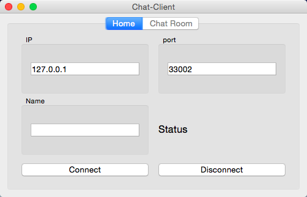
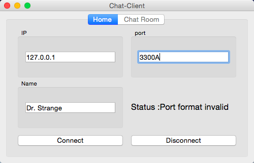
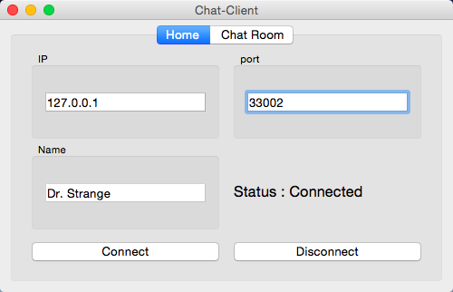
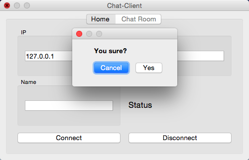
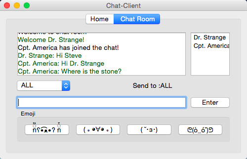
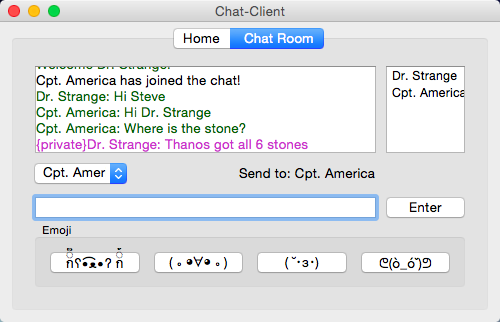
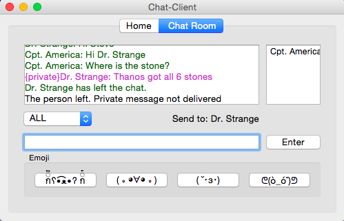

# Client User Interface for Chat Server

## Project Information


## Environment Requirement
- Python 3.6
- PyQt5
### Run the Server
```
python server.py --host 127.0.0.1 --port 33002
```
### Run the Client User Interface
```
python chatUI_v21.py
```
## Features
### General Design
- tabs for individual function: Home page or chat room
- chat room tab disabled until connection setup
- messagebox prompt to confirm exit, and disconnect before exit
### Home tab
- foolproof on connection/disconnection button: name column required, prevent repeat connecting/disconnecting
- unlimited remaking coonection
- unvalid port or unvalid IP, set to default IP 127.0.0.1 port 33002
- no worry refused connection, the exception code deal with it
### Chat Room tab
- message sending by either push GUI button or press keyboard enter
- clear the LineEdit widget after each message sent
- real-time received message display
- message column always scroll down to the newest message
- private message display on both sender and receiver, with color
- real-time updating of combobox and attendance list at receiving server broadcast
- once the receiver left before the private message sent, dispaly "Private message not delivered"
- window expanding space is preferd for message column
- EMOJI, that is what chat room ask for

## Screenshots







